# ClearVision Bug 修复计划

> **作者**: 蘅芜君  
> **日期**: 2026-02-23  
> **状态**: 待审批

---

## 问题总览

| # | Bug 描述 | 严重性 | 根因定位 |
|---|---------|--------|---------|
| 1 | 设置页打开后转圈很久 | P0 | 后端 `WebMessageHandler` 缺少 `settings.get`/`settings.save` 消息路由，前端等待响应 30s 超时 |
| 2 | AI 生成工程用不了 | P0 | 前端发送 `{ prompt }` 但后端从 `payload.description` 提取，字段名不匹配导致空描述；bridge 30s 超时太短 |
| 3 | 前端算子库仅有寥寥几个 | P1 | `operatorSchema.ts` 硬编码 10 个算子，后端 `OperatorFactory` 已注册 60+ 个 |
| 4 | 界面大量英文未汉化 | P1 | Vue 组件直接硬编码英文标签，未使用 i18n locale 体系 |

---

## Bug 1: 设置页加载转圈

### 根因分析

前端 `stores/settings.ts` 的 `openModal()` → `loadSettings()` 通过 `webMessageBridge.sendMessage('settings.get', {}, true)` 发送消息并等待响应。

但后端 [WebMessageHandler.cs](file:///c:/Users/11234/Desktop/ClearVision/Acme.Product/src/Acme.Product.Desktop/Handlers/WebMessageHandler.cs#L161-L239) 的 `switch(messageType)` 中**没有** `"settings.get"` 和 `"settings.save"` 的分支，消息会走到 `default` 分支被忽略，前端永远收不到响应，直到 bridge.ts 的 30s 超时触发 reject，表现为长时间转圈后报错。

### 修复方案

#### [MODIFY] [WebMessageHandler.cs](file:///c:/Users/11234/Desktop/ClearVision/Acme.Product/src/Acme.Product.Desktop/Handlers/WebMessageHandler.cs)

在 `switch(messageType)` 中新增两个 case：

```diff
+case "settings.get":
+    await HandleSettingsGetQuery(requestId);
+    break;
+
+case "settings.save":
+    await HandleSettingsSaveCommand(messageJson, requestId);
+    break;
```

新增两个处理方法：
- `HandleSettingsGetQuery`：通过 DI 获取 `IConfigurationService`，调用 `LoadAsync()` 读取配置，包装为 `{ settings: { general, camera, communication, ai } }` 格式返回（与前端 `AppSettings` 接口对齐）。
- `HandleSettingsSaveCommand`：解析传入的 settings JSON，调用 `SaveAsync()` 持久化。

> [!IMPORTANT]
> 必须确保返回的 JSON 结构与前端 `stores/settings.ts` 中 `AppSettings` 接口完全一致。

#### [MODIFY] [bridge.ts](file:///c:/Users/11234/Desktop/ClearVision/frontend/src/services/bridge.ts)

将 `sendMessage` 中的通用超时从 **30s** 调整为 **15s**（设置类操作不应等太久），并增加请求超时后的错误信息提示。

#### [MODIFY] [settings.ts](file:///c:/Users/11234/Desktop/ClearVision/frontend/src/stores/settings.ts)

`loadSettings` 的 catch 中增加用户可见的错误状态，避免永远显示 "Processing..."。增加 `errorMessage` ref 在 UI 中展示。

---

## Bug 2: AI 生成工程用不了

### 根因分析

前端 `stores/ai.ts` 调用：
```typescript
webMessageBridge.sendMessage(BridgeMessageType.AiGenerateFlow, { prompt }, true)
```

发送的消息体为 `{ messageType: 'GenerateFlowCommand', prompt: '一键测量', requestId: N }`。

但后端 `HandleGenerateFlowCommand` 中（第 518-519 行）：
```csharp
var payload = doc.RootElement.GetProperty("payload");          // ← 不存在 payload 字段！
var description = payload.GetProperty("description").GetString(); // ← 不存在 description 字段！
```

前端发的是 `{ prompt }` 而后端期望 `{ payload: { description } }`，**字段名完全不匹配**，导致 `GetProperty` 抛出 `KeyNotFoundException`，进入 `catch(Exception)` 返回错误。

此外，即使字段修正后，AI API 调用本身的耗时通常远超 bridge 的 30s 超时（DeepSeek 推理模型可能需要 60-120s），导致前端 bridge 超时报错 `"Request timeout for type: GenerateFlowCommand"`。

### 修复方案

#### [MODIFY] [WebMessageHandler.cs](file:///c:/Users/11234/Desktop/ClearVision/Acme.Product/src/Acme.Product.Desktop/Handlers/WebMessageHandler.cs)

修改 `HandleGenerateFlowCommand()`，兼容前端发送的 `prompt` 字段名：

```diff
-var payload = doc.RootElement.GetProperty("payload");
-var description = payload.GetProperty("description").GetString() ?? "";
+// 兼容两种前端消息格式：
+// 格式1（新）: { prompt: "xxx" }
+// 格式2（旧）: { payload: { description: "xxx" } }
+string description = "";
+if (doc.RootElement.TryGetProperty("prompt", out var promptProp))
+{
+    description = promptProp.GetString() ?? "";
+}
+else if (doc.RootElement.TryGetProperty("payload", out var payloadProp) &&
+         payloadProp.TryGetProperty("description", out var descProp))
+{
+    description = descProp.GetString() ?? "";
+}
```

#### [MODIFY] [WebMessageHandler.cs](file:///c:/Users/11234/Desktop/ClearVision/Acme.Product/src/Acme.Product.Desktop/Handlers/WebMessageHandler.cs)

AI 生成的消息路由需要回复 requestId：目前 `HandleGenerateFlowCommand` 不处理 requestId 回包——它直接用 `PostWebMessageAsJson` 发消息，但前端 bridge 是通过 `requestId` 来 resolve Promise 的。

需要在方法签名上增加 `requestId` 参数，并在最终回包中携带 `requestId`，使前端 bridge 能正确匹配回调。

#### [MODIFY] [bridge.ts](file:///c:/Users/11234/Desktop/ClearVision/frontend/src/services/bridge.ts)

为 AI 生成类的长耗时请求增加**独立的超时时间参数**：

```diff
-public async sendMessage<T = any>(type: string, data: any = null, expectResponse = false): Promise<T> {
+public async sendMessage<T = any>(type: string, data: any = null, expectResponse = false, timeoutMs = 30000): Promise<T> {
```

#### [MODIFY] [ai.ts](file:///c:/Users/11234/Desktop/ClearVision/frontend/src/stores/ai.ts)

调用 AI 生成时传入更长的超时（120s）：

```diff
-const response = await webMessageBridge.sendMessage(
-    BridgeMessageType.AiGenerateFlow,
-    { prompt },
-    true
+const response = await webMessageBridge.sendMessage(
+    BridgeMessageType.AiGenerateFlow,
+    { prompt },
+    true,
+    120000  // AI 生成需要更长超时
);
```

同时将默认问候语和错误提示汉化。

---

## Bug 3: 前端算子库只显示寥寥几个

### 根因分析

前端 [operatorSchema.ts](file:///c:/Users/11234/Desktop/ClearVision/frontend/src/config/operatorSchema.ts) 中 `OPERATOR_SCHEMAS` 数组仅硬编码了 **10** 个算子：

| 已有前端算子 |
|------------|
| ImageAcquisition, Filtering, EdgeDetection, Thresholding, Morphology, BlobAnalysis, TemplateMatching, Measurement, DeepLearning, ResultOutput |

而后端 `OperatorEnums.cs` 中定义了 **60+** 个 `OperatorType`，`OperatorFactory.cs` 中注册了每个算子的完整元数据。

### 修复方案（两阶段）

#### 阶段 A：新建算子元数据 API 端点（推荐的彻底方案）

##### [NEW] [OperatorEndpoints.cs](file:///c:/Users/11234/Desktop/ClearVision/Acme.Product/src/Acme.Product.Desktop/Endpoints/OperatorEndpoints.cs)

新增 REST API `/api/operators/metadata`，从 `IOperatorFactory.GetAllMetadata()` 返回所有算子元数据。

##### [MODIFY] [operatorSchema.ts](file:///c:/Users/11234/Desktop/ClearVision/frontend/src/config/operatorSchema.ts)

将硬编码列表改为**从后端 API 动态加载**，保留当前列表作为 fallback：

```typescript
export async function loadOperatorSchemas(): Promise<OperatorSchema[]> {
  try {
    const res = await fetch(`${window.__API_BASE_URL__}/operators/metadata`);
    const data = await res.json();
    return mapBackendToSchema(data);
  } catch {
    return OPERATOR_SCHEMAS; // fallback 到硬编码
  }
}
```

##### [MODIFY] [OperatorLibrary.vue](file:///c:/Users/11234/Desktop/ClearVision/frontend/src/components/flow/OperatorLibrary.vue)

在 `onMounted` 中调用 `loadOperatorSchemas()` 加载。

#### 阶段 B：临时补全硬编码（快速修复）

如暂不做 API 方案，可先将后端已注册的所有算子**手动补充**到 `operatorSchema.ts`。以下是缺失的关键算子列表：

| 缺失算子类型 | 中文名 | 分类 |
|------------|--------|------|
| Preprocessing | 预处理 | 预处理 |
| ContourDetection | 轮廓检测 | 特征提取 |
| CodeRecognition | 条码识别 | 识别 |
| MedianBlur | 中值滤波 | 预处理 |
| BilateralFilter | 双边滤波 | 预处理 |
| ImageResize | 图像缩放 | 预处理 |
| ImageCrop | 图像裁剪 | 预处理 |
| ImageRotate | 图像旋转 | 预处理 |
| PerspectiveTransform | 透视变换 | 预处理 |
| CircleMeasurement | 圆测量 | 检测 |
| LineMeasurement | 直线测量 | 检测 |
| ContourMeasurement | 轮廓测量 | 检测 |
| AngleMeasurement | 角度测量 | 检测 |
| GeometricTolerance | 几何公差 | 检测 |
| CameraCalibration | 相机标定 | 标定 |
| Undistort | 畸变校正 | 标定 |
| CoordinateTransform | 坐标转换 | 标定 |
| ModbusCommunication | Modbus通信 | 通信 |
| TcpCommunication | TCP通信 | 通信 |
| SerialCommunication | 串口通信 | 通信 |
| SiemensS7Communication | 西门子S7通信 | 通信 |
| MitsubishiMcCommunication | 三菱MC通信 | 通信 |
| OmronFinsCommunication | 欧姆龙FINS通信 | 通信 |
| DatabaseWrite | 数据库写入 | 输出 |
| ConditionalBranch | 条件分支 | 流程控制 |
| ColorConversion | 颜色空间转换 | 预处理 |
| AdaptiveThreshold | 自适应阈值 | 预处理 |
| HistogramEqualization | 直方图均衡化 | 预处理 |
| GeometricFitting | 几何拟合 | 检测 |
| RoiManager | ROI管理器 | 预处理 |
| ShapeMatching | 形状匹配 | 匹配定位 |
| SubpixelEdgeDetection | 亚像素边缘 | 特征提取 |
| ColorDetection | 颜色检测 | 检测 |
| ResultJudgment | 结果判定 | 判定 |
| ForEach | ForEach循环 | 流程控制 |
| ArrayIndexer | 数组索引器 | 数据操作 |
| JsonExtractor | JSON提取器 | 数据操作 |
| MathOperation | 数值计算 | 数据操作 |
| LogicGate | 逻辑门 | 数据操作 |
| TypeConvert | 类型转换 | 数据操作 |
| HttpRequest | HTTP请求 | 通信 |
| MqttPublish | MQTT发布 | 通信 |
| StringFormat | 字符串格式化 | 数据操作 |
| ImageSave | 图像保存 | 输出 |
| OcrRecognition | OCR识别 | 识别 |
| ImageDiff | 图像对比 | 检测 |
| Statistics | 统计分析 | 数据操作 |
| Aggregator | 聚合器 | 数据操作 |
| Comment | 注释 | 辅助 |
| Comparator | 比较器 | 数据操作 |
| Delay | 延时 | 流程控制 |

> [!TIP]
> **推荐采用阶段 A**（API 动态加载），一劳永逸，后续后端新增算子前端自动同步。阶段 B 仅为临时方案。

---

## Bug 4: 界面英文未汉化

### 根因分析

虽然 `locales/zh-CN.json` 中已有少量翻译条目，但绝大多数 Vue 组件**直接硬编码英文字符串**，未通过 i18n 引用翻译。

### 修复方案

**策略：直接将英文文本替换为中文**（项目当前以中文为主要语言，不需要运行时语言切换），而非引入完整的 vue-i18n 框架。

#### 需要汉化的文件清单

| 文件 | 需汉化的英文内容 |
|------|----------------|
| [SettingsModal.vue](file:///c:/Users/11234/Desktop/ClearVision/frontend/src/components/settings/SettingsModal.vue) | "Settings" → "系统设置", "Configure system preferences..." → "配置系统偏好与默认值", "Cancel" → "取消", "Save Changes" → "保存更改", "Processing..." → "处理中...", tab labels: General→通用, Camera→相机, Communication→通信, Database→数据库, AI Assistance→AI助手, About→关于 |
| [OperatorLibrary.vue](file:///c:/Users/11234/Desktop/ClearVision/frontend/src/components/flow/OperatorLibrary.vue) | "Library" → "算子库", "Search operators..." → "搜索算子...", "No operators found." → "未找到算子" |
| [ai.ts](file:///c:/Users/11234/Desktop/ClearVision/frontend/src/stores/ai.ts) | greeting content → "你好！我是 ClearVision AI，有什么可以帮你构建检测工程的？", "Workflow generated successfully." → "工程生成成功", "Generation failed:" → "生成失败:", clearHistory message → "对话已清空，有什么可以帮你？" |
| [AiChatSidebar.vue](file:///c:/Users/11234/Desktop/ClearVision/frontend/src/components/ai/AiChatSidebar.vue) | 需逐个检查英文文本 |
| [AiInsightsPanel.vue](file:///c:/Users/11234/Desktop/ClearVision/frontend/src/components/ai/AiInsightsPanel.vue) | 需逐个检查英文文本 |
| [AiFlowCanvas.vue](file:///c:/Users/11234/Desktop/ClearVision/frontend/src/components/ai/AiFlowCanvas.vue) | 需逐个检查英文文本 |
| [PropertyPanel.vue](file:///c:/Users/11234/Desktop/ClearVision/frontend/src/components/flow/PropertyPanel.vue) | 需逐个检查英文文本 |
| [FlowEditor.vue](file:///c:/Users/11234/Desktop/ClearVision/frontend/src/components/flow/FlowEditor.vue) | 需逐个检查英文文本 |
| [LintPanel.vue](file:///c:/Users/11234/Desktop/ClearVision/frontend/src/components/flow/LintPanel.vue) | 需逐个检查英文文本 |
| [ContextMenu.vue](file:///c:/Users/11234/Desktop/ClearVision/frontend/src/components/flow/ContextMenu.vue) | 需逐个检查英文文本 |
| [InspectionControls.vue](file:///c:/Users/11234/Desktop/ClearVision/frontend/src/components/inspection/InspectionControls.vue) | 需逐个检查英文文本 |
| [ImageViewer.vue](file:///c:/Users/11234/Desktop/ClearVision/frontend/src/components/inspection/ImageViewer.vue) | 需逐个检查英文文本 |
| [NodeOutputPanel.vue](file:///c:/Users/11234/Desktop/ClearVision/frontend/src/components/inspection/NodeOutputPanel.vue) | 需逐个检查英文文本 |
| [ProjectDashboard.vue](file:///c:/Users/11234/Desktop/ClearVision/frontend/src/components/projects/ProjectDashboard.vue) | 需逐个检查英文文本 |
| [ProjectSidebar.vue](file:///c:/Users/11234/Desktop/ClearVision/frontend/src/components/projects/ProjectSidebar.vue) | 需逐个检查英文文本 |
| [ResultsDetailPanel.vue](file:///c:/Users/11234/Desktop/ClearVision/frontend/src/components/results/ResultsDetailPanel.vue) | 需逐个检查英文文本 |
| [ResultsFilterSidebar.vue](file:///c:/Users/11234/Desktop/ClearVision/frontend/src/components/results/ResultsFilterSidebar.vue) | 需逐个检查英文文本 |
| [ResultsMainView.vue](file:///c:/Users/11234/Desktop/ClearVision/frontend/src/components/results/ResultsMainView.vue) | 需逐个检查英文文本 |
| [AppHeader.vue](file:///c:/Users/11234/Desktop/ClearVision/frontend/src/components/layout/AppHeader.vue) | 需逐个检查英文文本 |
| [AppStatusBar.vue](file:///c:/Users/11234/Desktop/ClearVision/frontend/src/components/layout/AppStatusBar.vue) | 需逐个检查英文文本 |
| Settings tabs: [GeneralTab.vue](file:///c:/Users/11234/Desktop/ClearVision/frontend/src/components/settings/tabs/GeneralTab.vue), [CameraTab.vue](file:///c:/Users/11234/Desktop/ClearVision/frontend/src/components/settings/tabs/CameraTab.vue), [CommunicationTab.vue](file:///c:/Users/11234/Desktop/ClearVision/frontend/src/components/settings/tabs/CommunicationTab.vue), [DatabaseTab.vue](file:///c:/Users/11234/Desktop/ClearVision/frontend/src/components/settings/tabs/DatabaseTab.vue), [AiTab.vue](file:///c:/Users/11234/Desktop/ClearVision/frontend/src/components/settings/tabs/AiTab.vue), [AboutTab.vue](file:///c:/Users/11234/Desktop/ClearVision/frontend/src/components/settings/tabs/AboutTab.vue) | 需逐个检查英文文本 |
| [bridge.mock.ts](file:///c:/Users/11234/Desktop/ClearVision/frontend/src/services/bridge.mock.ts) | mock 数据中的英文描述 |

---

## 执行优先级

```mermaid
gantt
    title Bug 修复执行顺序
    dateFormat X
    axisFormat %s

    section P0 - 阻断性Bug
    Bug1 设置页消息路由       :a1, 0, 2
    Bug2 AI生成字段匹配+超时  :a2, 2, 4

    section P1 - 功能缺陷
    Bug3 算子库补全（API方案） :b1, 4, 7
    Bug4 界面中文化            :b2, 7, 10
```



---

## 验证计划

### 自动化验证

1. **后端编译验证**
   ```powershell
   cd c:\Users\11234\Desktop\ClearVision\Acme.Product
   dotnet build Acme.Product.sln --configuration Debug
   ```

2. **前端编译验证**
   ```powershell
   cd c:\Users\11234\Desktop\ClearVision\frontend
   npx tsc --noEmit
   npm run build
   ```

3. **现有单元测试**
   ```powershell
   cd c:\Users\11234\Desktop\ClearVision\Acme.Product
   dotnet test tests/Acme.Product.Tests --filter "FullyQualifiedName~Sprint5_AIWorkflow" --no-build
   ```

### 手动验证

1. **Bug1**: 启动应用 → 点击设置齿轮按钮 → 应在 2 秒内加载完成（无转圈）→ 修改设置 → 保存 → 重新打开验证持久化
2. **Bug2**: 打开 AI 助手页 → 输入"一键测量" → 点击发送 → 应看到进度消息而非超时报错
3. **Bug3**: 打开流程编辑器 → 左侧算子库应显示全部分类和算子（至少 40+）
4. **Bug4**: 全局检查界面上不应出现未翻译的英文标签（Settings/Cancel/Library 等）
