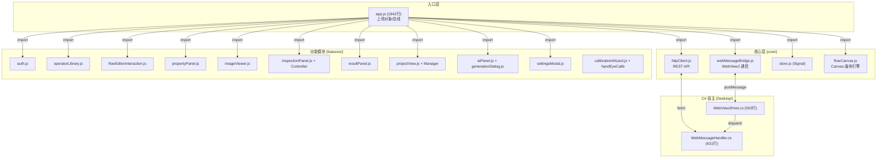

# ClearVision 前端界面全面升级 —— 工程审计报告

> **作者**: 蘅芜君
> **版本**: V1.0
> **创建日期**: 2026-02-21
> **最后更新**: 2026-02-21
> **文档编号**: report-frontend-upgrade-audit
> **状态**: 已完成

---

## 一、 审计目标

对《ClearVision 前端界面全面升级计划》（以下简称「计划」）进行全面的工程可行性审计，涵盖：

1. 当前代码量精确统计与复杂度分布
2. 模块耦合关系深度分析
3. 迁移路径中的技术风险识别
4. 工时与人力估算的校准
5. 对计划文档中遗漏或低估项的补充

---

## 二、 现有前端资产盘点

### 2.1 代码量统计

| 资产类型 | 文件数 | 总行数 | 总字节 |
|----------|--------|--------|--------|
| JavaScript (.js) | 27 | 13,752 | 569 KB |
| CSS (.css) | 18 | 8,066 | 213 KB |
| HTML（主页 `index.html`） | 1 | 873 | 44 KB |
| HTML（登录页 `login.html`） | 1 | 199 | 10 KB |
| **合计** | **47** | **22,890** | **836 KB** |

> [!WARNING]
> 计划中估算前端总代码量为"3000-5000 行"，实际 **JS + CSS 行数超过 21,800 行**，前端总体积约 836 KB。**实际工程量约为预估的 4-5 倍**。

### 2.2 JS 文件复杂度排名（Top 10）

| 排名 | 文件 | 字节 | 行数(估) | 分目录 | 复杂度评级 |
|------|------|------|----------|--------|-----------|
| 1 | `flowCanvas.js` | 80 KB | 2,128 | core/canvas | 🔴 极高 |
| 2 | `app.js` | 72 KB | 1,842 | (根) | 🔴 极高 |
| 3 | `settingsModal.js` | 52 KB | ~1,340 | features/settings | 🟠 高 |
| 4 | `operatorLibrary.js` | 51 KB | ~1,320 | features/operator-library | 🟠 高 |
| 5 | `resultPanel.js` | 31 KB | ~800 | features/results | 🟡 中 |
| 6 | `flowEditorInteraction.js` | 30 KB | ~780 | features/flow-editor | 🟠 高 |
| 7 | `handEyeCalibWizard.js` | 23 KB | ~590 | core/calibration | 🟡 中 |
| 8 | `aiPanel.js` | 21 KB | ~550 | features/ai | 🟡 中 |
| 9 | `propertyPanel.js` | 21 KB | ~550 | features/flow-editor | 🟡 中 |
| 10 | `calibrationWizard.js` | 21 KB | ~540 | features/calibration | 🟡 中 |

### 2.3 CSS 文件复杂度排名（Top 5）

| 排名 | 文件 | 字节 |
|------|------|------|
| 1 | `main.css` | 37 KB |
| 2 | `ui-components.css` | 28 KB |
| 3 | `results.css` | 23 KB |
| 4 | `inspection.css` | 20 KB |
| 5 | `ai-panel.css` | 16 KB |

---

## 三、 架构与耦合分析

### 3.1 模块依赖图



### 3.2 关键发现

| 编号 | 发现 | 风险等级 | 说明 |
|------|------|----------|------|
| F-01 | `app.js` 是"上帝对象" | 🔴 高 | 1842 行，69 个函数，承担路由、初始化、回调编排、状态管理、视图切换等全部职责。拆分为 Vue 组件时，需要将其中的胶合逻辑逐一归位到对应的 Vue 组件/Store 中。 |
| F-02 | 双通道通信架构 | 🟠 中 | 前端同时使用 `webMessageBridge.js`（WebView2 postMessage）和 `httpClient.js`（REST fetch）两套通信机制与 C# 后端通信。迁移时必须对两条路径分别封装。 |
| F-03 | FlowCanvas 是纯 Canvas 2D 引擎 | 🔴 高 | 2128 行手写 Canvas 代码，包含节点绘制、端口检测、连线管理、粒子动画、序列化/反序列化等。计划中提到"将 LiteGraph.js 封装到 Vue"，但**实际代码并未使用 LiteGraph.js，而是完全自研的 FlowCanvas**。此为计划中的**事实性错误**。 |
| F-04 | `index.html` 包含 873 行硬编码 UI | 🟠 中 | 所有视图（流程、检测、结果、工程、AI）的 HTML 骨架全部写在单一 `index.html` 中。迁移到 Vue SFC 时需要将其拆分到至少 6 个 `.vue` 文件中。 |
| F-05 | 自研 Signal 状态管理 | 🟢 低 | `store.js` 仅 82 行，实现了简易的 Signal 模式。迁移到 Pinia 时直接替换即可，风险较低。 |
| F-06 | CSS 设计系统已成型 | 🟡 中 | `variables.css` (8.8 KB) 定义了完整的 CSS 变量体系（颜色、间距、字体、阴影等），支持亮/暗双主题。迁移时应保留此设计语言，不宜重新设计。 |
| F-07 | 认证逻辑硬编码在 `app.js` 入口 | 🟡 中 | `initAuth()` 在模块顶层同步执行，未通过路由守卫控制。Vue Router 迁移时需要重构为 `beforeEach` 导航守卫。 |
| F-08 | 多处 `window.*` 全局挂载 | 🟠 中 | `flowCanvas`、`imageViewer`、`inspectionPanel`、`inspectionImageViewer`、`resultPanel` 等组件实例被挂到 `window` 上供跨模块访问。这是典型的全局状态耦合，迁移时必须用 Pinia 或 provide/inject 替代。 |

---

## 四、 对计划文档的校准与纠偏

### 4.1 事实性错误

| 编号 | 计划原文 | 实际情况 | 建议修正 |
|------|----------|----------|----------|
| E-01 | "将 LiteGraph.js 画布封装为 Vue 组件" | 项目**未使用** LiteGraph.js，流程图画布是自研的 `FlowCanvas` 类（2128 行纯 Canvas 2D） | 应改为"将自研 FlowCanvas 引擎封装为 Vue 组件 `FlowCanvas.vue`"，或评估是否迁移到 Vue Flow / Rete.js 等成熟方案 |
| E-02 | "前端总代码量约 3000-5000 行" | JS 实际 13,752 行，CSS 实际 8,066 行，HTML 约 1,072 行，**合计 22,890 行** | 重新估算基于 ~23,000 行的迁移工作量 |

### 4.2 遗漏项

| 编号 | 遗漏内容 | 重要程度 | 说明 |
|------|----------|----------|------|
| M-01 | `login.html` 迁移 | 🟡 中 | 199 行的独立登录页需要迁移为 Vue 路由页面，计划中未提及 |
| M-02 | `httpClient.js` 的 REST 通信 | 🟠 高 | 计划只提到了 WebView2 postMessage 封装，遗漏了 HTTP REST 通道的迁移。应将 `httpClient` 封装为 Axios 实例后注入到 Vue 应用中 |
| M-03 | 手眼标定向导 (`handEyeCalibWizard.js`) | 🟡 中 | 590行的复杂多步骤向导，计划中未列为独立迁移项 |
| M-04 | `lintPanel.js` (Flow Linter 面板) | 🟢 低 | 178行，需要作为 FlowEditor 的子组件迁移 |
| M-05 | 共享组件层 (`shared/components/`) 迁移 | 🟡 中 | `dialog.js`(9.5KB)、`splitPanel.js`(6.5KB)、`treeView.js`(8.8KB)、`tooltip.js`(3KB)、`uiComponents.js`(12.7KB) 共 5 个通用组件需逐一用 Vue 组件或 Element Plus 替代 |
| M-06 | CSS 主题切换机制迁移 | 🟡 中 | 现有的 `data-theme` 属性 + CSS 变量双主题系统需在 Vue 中保留 |
| M-07 | C# 侧 `WebView2Host.cs` 的入口页变更 | 🟢 低 | Vite 构建产物的文件名和路径与现有 `wwwroot/index.html` 不同，需修改 `LoadInitialPage()` 的导航路径 |

### 4.3 工时估算校准

| 模块 | 计划估算 | 审计修正 | 原因 |
|------|----------|----------|------|
| 总体 | 1.5-2 周 | **3-4 周** | 实际代码量为预估的 4-5 倍 |
| FlowCanvas 封装 | 未单独估算 | **3-5 天** | 2128 行自研 Canvas 引擎，需要精密的 Vue 生命周期管理和事件委托 |
| 通信层重构 | 未单独估算 | **1-2 天** | 需要同时处理 WebView2 postMessage 和 REST 两条通道 |
| `app.js` 拆解 | 未单独估算 | **2-3 天** | 69 个函数需要归位到对应的 Vue 组件/composable/store |
| `index.html` 拆分 | 未单独估算 | **1-2 天** | 873 行 HTML 拆分到 6+ 个 Vue SFC |
| Settings/Calibration 向导 | 未单独估算 | **2 天** | 两个 50KB+ 的表单密集型模块需要精细迁移 |
| CSS 体系迁移 | 未提及 | **1 天** | 需确保 8066 行 CSS + 变量体系完整迁移到新构建管线中 |

---

## 五、 技术风险矩阵

| 风险 | 概率 | 影响 | 缓解措施 |
|------|------|------|----------|
| FlowCanvas 事件系统与 Vue 响应式冲突 | 高 | 高 | 将 FlowCanvas 视为"黑盒"外围组件，仅通过 props/emit 交互，内部保留原有 Canvas 逻辑 |
| WebView2 通信在 Vite dev server 中不可用 | 高 | 高 | 维护 `mockMode` 模拟层，开发阶段使用 Mock 数据；集成测试在 WinForms 宿主中进行 |
| `window.*` 全局引用导致迁移遗漏 | 中 | 中 | 全局搜索 `window.flowCanvas`、`window.imageViewer` 等引用点，逐一替换为 Pinia store 或 provide/inject |
| CSS 变量优先级在 TailwindCSS 下被覆盖 | 中 | 低 | TailwindCSS 配置中使用 `theme.extend` 桥接现有 CSS 变量，避免冲突 |
| 登录流程在 Vue Router 迁移后出现竞态 | 低 | 高 | 使用 `router.beforeEach` + Pinia auth store 的组合替代当前的同步阻塞式检查 |

---

## 六、 推荐的迁移策略修订

### 6.1 推荐策略：**渐进式 Single-SPA / 混合过渡**（非一步到位全量重写）

> [!IMPORTANT]
> 鉴于实际代码量（~23,000 行）远超预估，建议**不采用**计划中的"一步到位"方案 A，而是分阶段迁移：

| 阶段 | 内容 | 产出 | 预计工时 |
|------|------|------|----------|
| **Phase 0** | 搭建 Vite + Vue 3 + TS 脚手架，配置 Pinia/i18n/Router | 空壳运行 | 0.5 天 |
| **Phase 1** | 迁移通信层（`bridge.ts` + `apiClient.ts`）+ 登录页 + 认证 store | 可登录 | 2 天 |
| **Phase 2** | 迁移布局骨架（Header/Sidebar/StatusBar）+ 视图路由切换 | 导航可用 | 2 天 |
| **Phase 3** | 封装 FlowCanvas 为 Vue 组件 + 算子面板 + 属性面板 | 核心编辑器可用 | 5 天 |
| **Phase 4** | 迁移检测视图 + 结果面板 + 工程管理 | 全功能可用 | 3 天 |
| **Phase 5** | 迁移 AI 面板 + 设置面板 + 标定向导 | 全量迁移完成 | 3 天 |
| **Phase 6** | i18n 词条提取 + RBAC 权限指令 + E2E 测试 | 增强功能 | 3 天 |
| **合计** | — | — | **~18.5 天（约 4 周）** |

### 6.2 FlowCanvas 迁移策略建议

`FlowCanvas` 是本次迁移中**复杂度最高**的单体模块。建议：

1. **Phase 3 中直接复用原有 FlowCanvas 类**，不重写内部逻辑：
   - 在 `FlowCanvasWrapper.vue` 的 `onMounted` 中实例化 `FlowCanvas`
   - 在 `onUnmounted` 中调用 `destroy()` 防止内存泄漏
   - 通过 `defineExpose` 暴露必要的 API (`addNode`, `serialize`, `deserialize` 等)
   - 用 `watch` 监听 Pinia store 变化，驱动画布更新

2. **长期（Phase 7+）**：评估是否迁移到 [Vue Flow](https://vueflow.dev/) 或 [Rete.js](https://rete.js.org/) 等成熟的 Vue 流程图框架，彻底替代自研 Canvas 引擎。

---

## 七、 综合评价

| 维度 | 评分 | 说明 |
|------|------|------|
| 计划完整性 | ★★★☆☆ | 技术方向正确，但代码量估算偏差大，遗漏多个关键模块（REST 通道、登录页、向导等） |
| 技术方案合理性 | ★★★★☆ | Vue 3 + Vite + Pinia + Element Plus 的选型科学合理，适合桌面端工业软件 |
| 风险识别 | ★★☆☆☆ | 未识别 FlowCanvas 自研事实与双通道通信架构，风险预案不足 |
| 工时估算准确性 | ★★☆☆☆ | 原始估算（1.5-2 周）与审计修正后（3-4 周）差距约 2 倍 |

### 结论

该计划的**技术栈选型和整体方向完全正确**，但在工程量评估、关键模块识别和迁移策略上存在显著偏差。建议按照本审计报告修订后的 **6 阶段渐进式迁移路径** 执行，将高风险模块（FlowCanvas、通信层）前置处理，确保每个阶段都有可验证的交付物。

---

## 八、 算子输出数据全景分析与前端展示增强方案

### 8.1 PortDataType 枚举全表

系统共定义 **14 种端口数据类型**（`PortDataType` 枚举）：

| 编号 | 类型 | 中文名 | 产出该类型的代表算子 |
|------|------|--------|---------------------|
| 0 | `Image` | 图像 | 几乎所有视觉算子 |
| 1 | `Integer` | 整数 | BlobCount, ContourCount, CircleCount, LineCount, CycleCount, StatusCode |
| 2 | `Float` | 浮点数 | Distance, Radius, Angle, Area, Perimeter, Score, Cpk, Tolerance, DiffRate |
| 3 | `Boolean` | 布尔值 | IsMatch, IsOk, Status, IsSuccess, HasError, IsCapable |
| 4 | `String` | 字符串 | **OCR Text**, **条码 Text/CodeType**, Response, Details, CalibrationData, FilePath, Error |
| 5 | `Point` | 点坐标 | Position(匹配位置), Center(圆心) |
| 6 | `Rectangle` | 矩形 | （已定义但暂无算子产出） |
| 7 | `Contour` | 轮廓 | Blobs, Contours |
| 8 | `PointList` | 点列表 | （已定义但暂无算子产出） |
| 9 | `DetectionResult` | 单个检测结果 | （已定义但暂无算子直接产出） |
| 10 | `DetectionList` | 检测列表 | DeepLearning → Defects |
| 11 | `CircleData` | 圆数据 | CircleMeasurement → Circle |
| 12 | `LineData` | 直线数据 | LineMeasurement → Line |
| 99 | `Any` | 任意 | ForEach Results, Aggregator MergedList, JsonExtractor Value |

### 8.2 按输出信息族分类的算子矩阵

将 55+ 算子按**输出信息族**（而非传统的功能分类）重新分组，揭示前端展示需求：

#### 族 A：纯图像透传型（仅输出 Image）— 无需额外展示

| 算子 | 输出端口 |
|------|----------|
| 滤波, 中值滤波, 双边滤波 | `Image` |
| 二值化, 自适应阈值 | `Image` |
| 形态学, 形态学操作 | `Image` |
| 图像缩放, 裁剪, 旋转, 透视变换 | `Image` |
| 颜色空间转换, 直方图均衡化, CLAHE, 拉普拉斯锐化 | `Image` |
| 图像加法, 融合 | `Image` |
| ROI管理器 | `Image` + `Mask(Image)` |

> **前端影响**：当前检测视图已能处理，无需额外 UI 改造。

#### 族 B：文本输出型 — ⚠️ **当前 UI 无法展示**

| 算子 | 关键输出端口 | 数据样例 |
|------|-------------|----------|
| **OCR 识别** | `Text: String` + `IsSuccess: Boolean` | `"SN-20260221-001"` |
| **条码识别** | `Text: String` + `CodeType: String` + `CodeCount: Integer` | `"https://example.com"` / `"QR"` |
| **相机标定** | `CalibrationData: String` | JSON 格式标定矩阵 |
| **图像保存** | `FilePath: String` + `IsSuccess: Boolean` | `"C:\ClearVision\NG\img001.jpg"` |
| **注释** | `Message: String` | 用户自定义文本 |

> [!CAUTION]
> **OCR 和条码识别是核心工业场景**（如产线序列号读取、包装信息校验），但当前检测界面和结果界面**完全没有文本结果展示区域**。这是最急迫的 UI 缺口。

#### 族 C：数值测量型 — ⚠️ **当前仅显示处理时间**

| 算子 | 关键输出端口 | 数据样例 |
|------|-------------|----------|
| **测量** | `Distance: Float` | `125.73 mm` |
| **圆测量** | `Radius: Float` + `Center: Point` + `CircleCount: Integer` | `R=23.5, (320,240), 3个` |
| **直线测量** | `Angle: Float` + `Length: Float` + `LineCount: Integer` | `θ=45.2°, L=198.5px` |
| **轮廓测量** | `Area: Float` + `Perimeter: Float` + `ContourCount: Integer` | `A=15234, P=498.2, 5个` |
| **角度测量** | `Angle: Float` | `89.7°` |
| **几何公差** | `Tolerance: Float` | `⊥ 0.023mm` |
| **坐标转换** | `PhysicalX: Float` + `PhysicalY: Float` | `(12.5mm, 8.3mm)` |
| **数值计算** | `Result: Float` + `IsPositive: Boolean` | `42.0` |
| **统计分析** | `Mean, StdDev, Min, Max, Cpk: Float` + `Count: Integer` | `μ=10.02, σ=0.15, Cpk=1.67` |
| **图像减法** | `MinDiff, MaxDiff, MeanDiff: Float` | `Δ=12.3` |
| **图像对比** | `DiffRate: Float` | `3.2%` |
| **比较器** | `Result: Boolean` + `Difference: Float` | `PASS, Δ=0.5` |

#### 族 D：判定/状态型 — ⚠️ **当前仅 OK/NG 两态**

| 算子 | 关键输出端口 | 数据样例 |
|------|-------------|----------|
| **模板匹配** | `Score: Float` + `Position: Point` + `IsMatch: Boolean` | `Score=0.95, (150,200), ✓` |
| **深度学习** | `Defects: DetectionList` + `DefectCount: Integer` | `[{type:"划痕", conf:0.92, bbox:[...]}]` |
| **结果判定** | `IsOk: Boolean` + `JudgmentValue: String` + `Details: String` | `OK, "1", "缺陷数0=0"` |
| **双模态投票** | `IsOk: Boolean` + `Confidence: Float` + `JudgmentValue: String` | `OK, 0.87, "1"` |
| **条件分支** | `True/False: Any` | 分流 |

#### 族 E：通信响应型 — ⚠️ **当前完全没有展示**

| 算子 | 关键输出端口 | 数据样例 |
|------|-------------|----------|
| **Modbus通信** | `Response: String` + `Status: Boolean` | `"0x1234"`, ✓ |
| **TCP通信** | `Response: String` + `Status: Boolean` | `"ACK"` |
| **西门子S7/三菱MC/欧姆龙FINS** | `Response: String` + `Status: Boolean` | `"DB1.DBW100=42"` |
| **串口通信** | `Response: Any` | `"OK\r\n"` |
| **HTTP请求** | `Response: String` + `StatusCode: Integer` + `IsSuccess: Boolean` | `200, {"result":"ok"}` |
| **MQTT发布** | `IsSuccess: Boolean` | ✓ |
| **数据库写入** | `Status: Boolean` + `RecordId: String` | `✓, "rec-0042"` |

#### 族 F：集合/结构型 — 需要表格或树形展示

| 算子 | 关键输出端口 |
|------|-------------|
| **Blob分析** | `Blobs: Contour` + `BlobCount: Integer` |
| **轮廓检测** | `Contours: Contour` + `ContourCount: Integer` |
| **ForEach** | `Results: Any` (列表) |
| **聚合器** | `MergedList: Any` + `MaxValue/MinValue/Average: Float` |
| **数组索引器** | `Item: Any` |
| **JSON提取器** | `Value: Any` + `IsSuccess: Boolean` |

### 8.3 检测界面与结果界面增强方案

> [!IMPORTANT]
> 现有检测界面仅有：① 图像显示区 ② OK/NG 计数 ③ 处理时间。无法承载上述 B~F 族的丰富输出。

**推荐的检测结果页布局**（三栏式）：

```
┌──────────────────────────────────────────────────────────────┐
│                        检测结果 Dashboard                     │
├───────────────┬──────────────────┬───────────────────────────┤
│   ① 图像区    │   ② 节点输出     │   ③ 综合面板              │
│   (Image)     │   数据卡片区      │                           │
│               │                  │   ┌─────────────────┐     │
│   结果图像     │   ┌──────────┐  │   │ OK/NG 大按钮     │     │
│   叠加标注     │   │ OCR 文本  │  │   │ 置信度仪表盘     │     │
│   缺陷框      │   │ ─────── │  │   │ 处理时间          │     │
│   测量线      │   │ 条码内容  │  │   └─────────────────┘     │
│               │   │ ─────── │  │                           │
│               │   │ 测量数据  │  │   ┌─────────────────┐     │
│               │   │ 距离:125mm│  │   │ 通信状态监控      │     │
│               │   │ 角度:45.2°│  │   │ PLC: ✓ ACK       │     │
│               │   │ ─────── │  │   │ DB:  ✓ rec-042   │     │
│               │   │ 缺陷列表  │  │   └─────────────────┘     │
│               │   │ [{...}]  │  │                           │
│               │   └──────────┘  │   统计趋势图 (CPK)         │
│               │                  │   近期结果历史列表         │
└───────────────┴──────────────────┴───────────────────────────┘
```

**② 节点输出数据卡片**的核心设计：

| 输出族 | 推荐 UI 组件 | 说明 |
|--------|-------------|------|
| 文本型 (B) | **文本卡片** + 复制按钮 | OCR/条码结果大字体展示，支持一键复制 |
| 测量型 (C) | **数值仪表盘** + 上下限指示 | 带公差带的数值显示，超限变红 |
| 判定型 (D) | **OK/NG 指示灯** + 缺陷表格 | DetectionList 用可折叠表格展示每个缺陷的 bbox、类型、置信度 |
| 通信型 (E) | **状态徽标** + 响应日志 | 绿/红圆点表示通信成功/失败，展开查看响应内容 |
| 集合型 (F) | **可展开表格/JSON 树** | 列表数据用虚拟滚动表格，嵌套结构用 JSON 树 |

**建议的实现组件**（Vue 3 + Element Plus）：

| 组件 | 文件名 | 用途 |
|------|--------|------|
| `TextResultCard.vue` | 文本结果展示 | OCR、条码识别文本 |
| `MeasurementGauge.vue` | 测量数值仪表 | 距离、角度、面积等 + 公差带 |
| `DefectTable.vue` | 缺陷列表表格 | 深度学习检测结果 |
| `CommStatusCard.vue` | 通信状态卡片 | PLC/TCP/HTTP 响应 |
| `NodeOutputPanel.vue` | 节点输出面板容器 | 根据节点类型动态渲染对应的卡片组件 |
| `StatsChart.vue` | 统计趋势图 | CPK、均值趋势、SPC 控制图 |

---

## 九、 ComfyUI 风格画布可行性分析

### 9.1 ComfyUI 技术架构解析

ComfyUI 的节点画布核心技术栈：

| 层级 | 技术 | 功能 |
|------|------|------|
| 节点引擎 | **LiteGraph.js** | Canvas 2D 渲染、节点/连线管理、序列化 |
| 通信 | **WebSocket** (`/ws`) | 实时节点执行状态、进度推送 |
| 前端框架 | Svelte / SvelteKit（新版） | UI 外壳与控件 |
| 后端 | Python (aiohttp) | 工作流执行引擎 |

ComfyUI 的核心视觉特征：

1. **节点内嵌参数编辑** — 参数直接在节点体内编辑（下拉框、滑块、文件选择器等）
2. **实时预览** — 节点执行后在节点内直接显示缩略图结果
3. **彩色连线** — 不同数据类型用不同颜色的连线
4. **节点分组** — 可将多个节点框选为一组
5. **右键上下文菜单** — 丰富的右键功能
6. **执行状态指示** — 节点边框动画显示执行进度

### 9.2 ClearVision 现有 FlowCanvas 与 ComfyUI 的差距

| 特性 | ComfyUI (LiteGraph.js) | ClearVision FlowCanvas | 差距 |
|------|----------------------|----------------------|------|
| 节点内参数编辑 | ✅ 完整的 Widget 系统 | ❌ 参数在右侧属性面板 | 🔴 大 |
| 节点内图像预览 | ✅ 缩略图嵌入节点 | ❌ 仅在独立图像查看器 | 🔴 大 |
| 彩色类型连线 | ✅ 丰富的颜色映射 | ✅ 已有 `PORT_TYPE_COLORS` | 🟢 已实现 |
| 节点分组 | ✅ | ❌ | 🟡 中 |
| 右键菜单 | ✅ | ⚠️ 基础实现 | 🟡 中 |
| 拖拽添加节点 | ✅ | ✅ 从算子库拖拽 | 🟢 已实现 |
| 连线类型兼容检查 | ✅ | ✅ `checkTypeCompatibility()` | 🟢 已实现 |
| 执行状态动画 | ✅ 边框进度条 | ✅ 状态指示器 + 粒子动画 | 🟢 已实现 |
| 节点搜索 | ✅ | ✅ 算子库搜索 | 🟢 已实现 |
| 子图/嵌套 | ✅ Node Expansion | ✅ ForEach 子图 | 🟢 已实现 |
| 节点主体 DOM | HTML Widget (LiteGraph) | 纯 Canvas 2D 绘制 | 🔴 架构差异 |

### 9.3 实现 ComfyUI 风格的技术路线评估

#### 路线 A：在现有 FlowCanvas 上渐进增强

| 项 | 详情 |
|---|---|
| **思路** | 在自研 FlowCanvas (Canvas 2D) 基础上，增加节点内 Widget 渲染和图像缩略图 |
| **难度** | 🔴 **极高** — Canvas 2D 不支持原生 DOM 元素（输入框/下拉菜单/滑块）的嵌入。需要自行实现所有表单控件的 Canvas 版本，工作量巨大且交互体验难以媲美原生 HTML |
| **预计工时** | 3-5 周 |
| **风险** | Canvas 2D 内的文本编辑、光标定位、下拉浮层等交互极其复杂，基本等于重新造一个 GUI 工具包 |
| **推荐度** | ⭐☆☆☆☆ 不推荐 |

#### 路线 B：替换为 Vue Flow (@vue-flow/core)

| 项 | 详情 |
|---|---|
| **思路** | 用 Vue Flow 替代自研 FlowCanvas。Vue Flow 基于 SVG/HTML 渲染，天然支持在节点内嵌入任意 Vue 组件 |
| **难度** | 🟡 **中** — Vue Flow 提供完整的节点、边、缩放/平移基础设施，自定义节点可使用 Vue SFC |
| **优势** | ① 节点内嵌入 Element Plus 表单控件 ② 天然支持 Vue 响应式 ③ 活跃社区 (月 150K+ NPM 下载) ④ TypeScript 原生 |
| **劣势** | ① SVG 渲染在 500+ 节点时性能不如 Canvas ② 连线动画需自行实现 ③ 需重写 `serialize/deserialize` 逻辑 |
| **预计工时** | **1-2 周**（含节点模板、连线逻辑、序列化兼容层） |
| **推荐度** | ⭐⭐⭐⭐☆ **推荐** |

#### 路线 C：替换为 Rete.js v2

| 项 | 详情 |
|---|---|
| **思路** | 用 Rete.js 替代自研 FlowCanvas。Rete.js 是专为"可执行节点图"设计的框架，内置 Dataflow 引擎 |
| **难度** | 🟡 **中** — 需学习 Rete.js 的插件体系和渲染协议 |
| **优势** | ① 内置 Dataflow/Control Flow 引擎 ② 支持 Vue/React/Angular 渲染器 ③ LOD 优化（大图性能好） ④ 最接近 ComfyUI 的设计理念 |
| **劣势** | ① v2 仍在 Beta ② 学习曲线较陡 ③ 社区规模小于 Vue Flow |
| **预计工时** | **2-3 周** |
| **推荐度** | ⭐⭐⭐☆☆ 可选 |

#### 路线 D：直接引入 LiteGraph.js（ComfyUI 同源）

| 项 | 详情 |
|---|---|
| **思路** | 直接使用与 ComfyUI 相同的 LiteGraph.js，获得最接近 ComfyUI 的体验 |
| **难度** | 🟡 **中** — LiteGraph.js 是纯 Vanilla JS，与 Vue 3 集成需要封装层 |
| **优势** | ① 百分百 ComfyUI 交互风格 ② 内置 Widget 系统 (combo, slider, number, string, toggle) ③ Canvas 2D 高性能 |
| **劣势** | ① 项目维护不活跃 ② Widget 是 Canvas 绘制而非原生 HTML，定制难度高 ③ 无 TypeScript 类型 ④ 社区评价"有点过时，难以扩展" |
| **预计工时** | **1.5-2 周** |
| **推荐度** | ⭐⭐⭐☆☆ 可选 |

### 9.4 综合推荐

> [!IMPORTANT]
> **推荐路线 B (Vue Flow)**，理由如下：

1. **与 Vue 3 + TypeScript 技术栈完美契合** — 节点即 Vue 组件，可直接复用 Element Plus 表单控件
2. **ComfyUI 核心交互均可实现**：
   - 节点内嵌参数编辑 → 自定义 Vue 节点组件，内嵌 `<el-select>`, `<el-slider>`, `<el-input>` 等
   - 节点内图像预览 → 在节点底部添加 `` 预览缩略图
   - 彩色连线 → Vue Flow 的 Custom Edge 支持按数据类型着色
   - 执行状态动画 → 通过 CSS class 动态切换节点边框样式
3. **数据兼容** — 可设计一个 `FlowSerializer` 适配层，将现有 FlowCanvas 的 JSON 格式转换为 Vue Flow 的节点/边格式，实现**无损数据迁移**
4. **性能足够** — 工业视觉工作流通常 20-100 个节点，远未达到 SVG 的性能瓶颈

**实施分期**：

| 阶段 | 内容 | 工时 |
|------|------|------|
| Phase 3a | Vue Flow 基础集成 + 自定义节点模板 + 连线 | 3 天 |
| Phase 3b | 数据序列化兼容层 + 拖拽添加节点 | 2 天 |
| Phase 3c | 节点内参数编辑 Widget + 图像缩略图预览 | 3 天 |
| Phase 3d | 执行状态动画 + 右键菜单 + 节点分组 | 2 天 |
| **合计** | — | **~10 天** |

> [!WARNING]
> 将 FlowCanvas 替换为 Vue Flow 后，原有 Phase 3 的 5 天估算需上调至 **10 天**，总体工时从 18.5 天上调至 **~24 天（约 5 周）**。

---

### 最终修订结论

该计划的**技术栈选型和整体方向完全正确**，但在以下方面需要补充修订：

1. **检测/结果界面 UI 增强** — 新增 6 类输出数据专用展示组件，预计额外 **3 天**
2. **ComfyUI 风格画布** — 推荐采用 **Vue Flow** 替代自研 FlowCanvas，预计额外 **5 天**
3. **修订后总工时** — 约 **24-27 天（5-6 周）**，含原始迁移 + UI 增强 + 画布升级

---

*文档维护：ClearVision 开发团队*
*审计日期：2026-02-21*
*V1.1 更新：补充算子输出分析与 ComfyUI 可行性评估*
