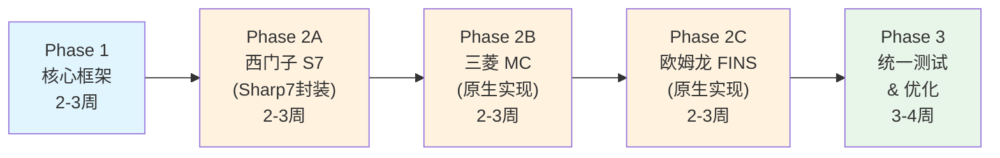

# HSL PLC 通信替代方案 — 评审意见与补充建议

**评审日期**: 2026-02-15  
**评审对象**: `HSL_PLC_Communication_Review_Plan.md` (v1.0, opencode 生成)  
**评审依据**: ClearVision 项目现有通信代码实际走读

---

## 1. 总体评价

> [!NOTE]
> 这份文档的**框架完整性很好**，从现状评估、架构分层、接口设计到实施计划都有覆盖。作为一份"方向性规划文档"，它确立了正确的目标。但在多个关键细节上需要补充和修正，才能作为实际开发依据。

| 维度 | 评分 | 评语 |
|------|------|------|
| **架构方向** | ⭐⭐⭐⭐ | 三层分离（传输/协议/算子）思路正确 |
| **现状分析** | ⭐⭐⭐ | 基本准确，但有遗漏和偏差 |
| **接口设计** | ⭐⭐⭐ | 方向正确，缺乏关键细节 |
| **协议实现** | ⭐⭐ | 协议细节描述不足，实施风险被低估 |
| **与现有代码的衔接** | ⭐⭐ | 未充分分析现有代码模式 |
| **工期估算** | ⭐⭐ | 偏乐观，总计 9-11 周不够 |

---

## 2. 现状分析的修正

文档对现有实现的描述有几处需要修正:

### 2.1 连接池实际情况

文档说 `ConnectionPoolManager` "架构良好，可扩展"——**这一评估偏高**。

**实际情况**: 现有的连接池管理是**分散的**，而非统一的：
- `ModbusCommunicationOperator` 内部用 `static ConcurrentDictionary` 自建连接池
- `TcpCommunicationOperator` 也有独立的 `static ConcurrentDictionary` 连接池
- `SerialCommunicationOperator` 完全没有连接池，每次 `using var port = new SerialPort(...)` 新建
- `ConnectionPoolManager` 确实存在，但现有的通信算子**并未实际使用它**

> [!WARNING]
> 这意味着"扩展 ConnectionPoolManager"之前，需要先让现有算子迁移到统一连接池。否则新旧算子的连接管理方式不一致，维护成本更高。

### 2.2 缺少对现有代码模式的分析

文档没有分析现有算子的共性代码模式，而这是设计新基类的基础。当前三个通信算子的共同模式：

```
OperatorBase → ExecuteCoreAsync() → 获取参数 → 建立连接 → 收发数据 → 返回结果
```

每个算子都有重复的：连接管理、超时处理、异常捕获与日志记录、结果封装。**这些共性应直接指导 `PlcOperatorBase` 的设计**。

---

## 3. 架构设计的补充建议

### 3.1 OperateResult 与现有 OperatorExecutionOutput 的关系

> [!IMPORTANT]
> 文档提出新增 `OperateResult<T>`，但项目已有 `OperatorExecutionOutput`（包含 `Success()` / `Failure()` 工厂方法和 `Dictionary<string, object>` 输出）。需要明确两者的关系：

建议方案：
- `OperateResult<T>` 只用于 **PLC 客户端内部**（协议层通信结果）
- `OperatorExecutionOutput` 保持不变，用于**算子层对外输出**
- 在算子中做映射：`OperateResult → OperatorExecutionOutput`

```csharp
// 不要让 OperateResult 替代 OperatorExecutionOutput
// 而是做一个干净的转换
if (result.IsSuccess)
    return OperatorExecutionOutput.Success(new Dictionary<string, object>
    {
        { "Value", result.Content },
        { "Status", true }
    });
else
    return OperatorExecutionOutput.Failure(result.ErrorMessage);
```

### 3.2 IPlcClient 接口补充

文档的 `IPlcClient` 接口缺少几个关键能力：

```csharp
public interface IPlcClient : IAsyncDisposable, IDisposable
{
    // --- 文档已有 ---
    string IpAddress { get; }
    int Port { get; }
    bool IsConnected { get; }
    Task<bool> ConnectAsync(CancellationToken ct = default);
    Task DisconnectAsync();
    
    // --- 需要补充 ---
    
    /// <summary>
    /// 批量读取：工业场景中单次读多个地址是常见需求
    /// </summary>
    Task<OperateResult<byte[]>> ReadAsync(string[] addresses, ushort[] lengths, CancellationToken ct = default);
    
    /// <summary>
    /// 连接状态检测（心跳），而非仅靠 IsConnected 属性
    /// </summary>
    Task<bool> PingAsync(CancellationToken ct = default);
    
    /// <summary>
    /// 自动重连策略配置
    /// </summary>
    ReconnectPolicy ReconnectPolicy { get; set; }
}

/// <summary>
/// 重连策略
/// </summary>
public class ReconnectPolicy
{
    public bool Enabled { get; set; } = true;
    public int MaxRetries { get; set; } = 3;
    public TimeSpan RetryInterval { get; set; } = TimeSpan.FromSeconds(2);
    public TimeSpan MaxRetryInterval { get; set; } = TimeSpan.FromSeconds(30);
    public bool ExponentialBackoff { get; set; } = true;
}
```

### 3.3 PlcBaseClient 需要关注的重点

文档只说"封装 TCP 连接管理"，但基类至少需要以下基础设施：

| 基础能力 | 说明 | 重要性 |
|----------|------|--------|
| **自动重连** | 工业环境下网络不稳定，必须有断线自动重连 | 🔴 必须 |
| **通信互斥锁** | PLC 通信通常是半双工，需要 SemaphoreSlim 保证请求串行 | 🔴 必须 |
| **字节序转换** | 不同 PLC 字节序不同（S7 大端，MC 小端），需要统一处理 | 🔴 必须 |
| **报文日志** | 收发的原始字节记录，用于调试 | 🟡 建议 |
| **超时分级** | 连接超时、读超时、写超时应该分开配置 | 🟡 建议 |
| **通信计数器** | 成功/失败/重连次数统计 | 🟢 可选 |

### 3.4 缺少的地址解析器设计细节

文档只说"定义 TryParse/Parse/ToString 方法"。实际地址解析是整个框架中**最容易出 Bug 的地方**，需要更详细的设计：

#### S7 地址格式示例
| 地址字符串 | 区域 | DB号 | 偏移 | 位偏移 | 数据长度 |
|-----------|------|------|------|--------|---------|
| `DB1.DBX0.0` | DB | 1 | 0 | 0 | 1 bit |
| `DB1.DBW100` | DB | 1 | 100 | - | 2 bytes |
| `DB1.DBD200` | DB | 1 | 200 | - | 4 bytes |
| `M100.3` | Merker | - | 100 | 3 | 1 bit |
| `I0.0` | Input | - | 0 | 0 | 1 bit |
| `Q0.1` | Output | - | 0 | 1 | 1 bit |

#### 三菱 MC 地址格式示例
| 地址字符串 | 软元件代码 | 十进制/十六进制 | 说明 |
|-----------|-----------|---------------|------|
| `D100` | 0xA8 | 十进制 | 数据寄存器 |
| `M100` | 0x90 | 十进制 | 内部继电器 |
| `X1F` | 0x9C | **十六进制** | 输入继电器 |
| `Y2A` | 0x9D | **十六进制** | 输出继电器 |

> [!CAUTION]
> 三菱的 X/Y 寄存器使用八进制地址编码，而 D/M 使用十进制。这是一个极容易出错的地方，必须在地址解析器中做特殊处理。

---

## 4. 协议实现的关键补充

### 4.1 S7 协议被低估的复杂度

文档的 S7 协议描述只有一个简单的协议栈图。实际上 S7 协议有几个非常容易忽略的关键点：

| 关键点 | 说明 |
|-------|------|
| **COTP 连接协商** | CR PDU 需要带 Remote TSAP 参数（包含 Rack/Slot），不同 CPU 的 TSAP 格式不同 |
| **PDU 大小协商** | 必须在 Setup Communication 阶段协商最大 PDU，S7-1200 默认 240 字节，S7-1500 默认 960 字节 |
| **分段读取** | 当读取数据超过 PDU 大小时必须分段，这是必须实现的 |
| **S7-1500 优化块访问** | 1500 系列的 DB 默认启用"优化块访问"，地址计算方式与 300/400 不同 |
| **数据类型映射** | S7 的 REAL 是 IEEE 754 大端，STRING 前两字节是最大长度和实际长度 |
| **密码保护** | 部分 PLC 启用了连接密码，需要支持认证握手 |

> [!TIP]
> **强烈建议使用 Sharp7 或 S7NetPlus 处理 S7 协议**，不要从零实现。S7 协议的坑太多，单独实现需要大量真机验证。文档推荐的"混合方案"（Sharp7 + 原生 MC/FINS）是正确的。

### 4.2 MC 协议补充

- 需要支持 ASCII 和 Binary 两种子帧格式，两者的帧结构完全不同
- Q 系列的 4E 帧比 3E 帧多了一个序列号字段（用于标识请求）
- iQ-R 系列支持 SLMP 协议，与传统 MC 协议有细微差别
- **批量读取的最大点数限制**：3E Binary 模式下读取 D 寄存器最大 960 点

### 4.3 FINS 协议补充

- FINS/TCP 首次连接需要一个**节点号交换握手**（发送客户端节点，接收服务端节点），这是 FINS/TCP 特有的
- FINS/UDP 不需要握手但需要手动管理 SID（Service ID）
- 欧姆龙的内存区域比文档描述的更多：CIO、WR、HR、AR、DM、TIM、CNT、EM 等

---

## 5. 工期估算修正

### 文档估算 vs 建议估算

| 阶段 | 文档估算 | 建议估算 | 原因 |
|------|---------|---------|------|
| Phase 1: 核心架构 | 2-3 周 | 2-3 周 | ✅ 基本合理 |
| Phase 2: 协议实现 | 3-4 周 | **5-6 周** | S7/MC/FINS 各有大量边界情况 |
| Phase 3: 算子集成 | 2 周 | 2-3 周 | 含现有算子迁移统一连接池 |
| Phase 4: 测试优化 | 2 周 | **3-4 周** | 需要真机联调，不同型号兼容性测试耗时 |
| **合计** | **9-11 周** | **12-16 周** | — |

> [!WARNING]
> 最大的风险在于**缺乏真机测试环境**。如果没有实际的 S7-1200/1500、三菱 FX5U/Q 系列、欧姆龙 CP/CJ 系列 PLC，仅靠模拟器，很多兼容性问题无法提前发现。建议在 Phase 2 后安排一个"真机验证里程碑"。

---

## 6. 新增建议：分阶段策略

原文档计划一次性支持西门子、三菱、欧姆龙三个品牌。建议改为**逐品牌迭代**，降低一次性风险：

### 建议的分阶段路线



**优势**：
1. 每完成一个品牌就可以**验证架构设计**，发现问题后调整不影响后续
2. 最先完成的 S7（工业现场最常见）可以先投产体验验证
3. 如果某个品牌需求不紧急，可以延后而不阻塞整体

---

## 7. 文档遗漏项目清单

以下是文档未涉及但实际开发中必须解决的问题：

| 序号 | 遗漏项 | 重要性 | 说明 |
|------|-------|--------|------|
| 1 | **前端 UI 支持** | 🔴 高 | 新增3类PLC算子后，前端的算子面板、参数配置 UI 需要同步更新 |
| 2 | **现有通信算子重构** | 🟡 中 | Modbus/TCP/Serial 是否也要迁移到 PlcBaseClient 体系？ |
| 3 | **连接持久化** | 🟡 中 | 用户配置的 PLC 连接信息是否需要保存到项目文件/数据库？ |
| 4 | **字符串数据类型支持** | 🟡 中 | PLC 中的 STRING 类型（特别是 S7 的 STRING 和 WSTRING）处理 |
| 5 | **大端/小端配置** | 🟡 中 | 不同品牌默认字节序不同，需要可配置 |
| 6 | **批量操作优化** | 🟡 中 | 多个地址的读写应合并为单次 PDU 请求 |
| 7 | **前端算子图标** | 🟢 低 | 三个新算子需要对应的 SVG 图标 |
| 8 | **日志与诊断** | 🟢 低 | 原始报文的十六进制 dump 对协议调试非常关键 |

---

## 8. 关于第三方库的补充建议

### S7 协议

| 库 | 许可 | 优劣 | 建议 |
|----|------|------|------|
| **Sharp7** | MIT | 轻量单文件，C 语言移植，经过工业验证 | ✅ 推荐 |
| **S7NetPlus** | MIT | 纯 C# 实现，API 更友好，支持异步 | ✅ 也可考虑 |
| **Snap7** | LGPL | 底层 C 库，需要 P/Invoke | ⚠️ LGPL 需注意 |

> [!TIP]
> **S7NetPlus** 实际上比 Sharp7 的 API 更现代化（支持 async/await），且维护更活跃。建议也纳入评估范围：
> - NuGet: `S7NetPlus` (https://github.com/S7NetPlus/s7netplus)

### MC / FINS 协议

由于三菱和欧姆龙没有成熟的 MIT 开源库，原生实现是唯一选择。但可以参考以下开源项目的实现：

- **MCProtocol**: https://github.com/jabelar/MCProtocol (MIT, 三菱 MC 参考)
- **FINS-Protocol**: 可参考 HslCommunication 的 FINS 实现思路

---

## 9. 总结与建议行动

### 建议立即执行

1. **确定优先支持哪个 PLC 品牌**（建议先做西门子 S7，现场最常用）
2. **评估 S7NetPlus vs Sharp7**（跑一个概念验证 spike）
3. **设计统一连接池**（先重构现有 Modbus/TCP 算子迁移到 ConnectionPoolManager）

### 建议在开发前补充

1. 完善地址解析的详细规格（每种地址格式的正则/解析规则）
2. 定义清楚 `OperateResult<T>` 与 `OperatorExecutionOutput` 的边界
3. 确认是否有真机测试环境，如果没有，优先搞定模拟器方案

### 建议修改文档

1. 修正 ConnectionPoolManager 现状描述
2. 补充字节序处理方案
3. 补充前端 UI 变更范围
4. 调整工期估算至 12-16 周

---

**文档结束**
