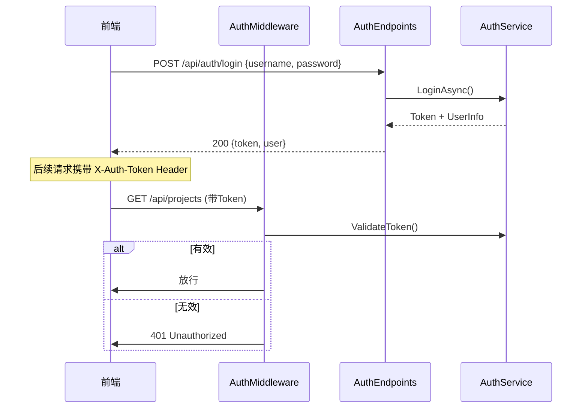

# ClearVision 用户系统开发计划

> **编制日期**: 2026-02-14 | **当前状态**: V1.0 (Phase 6 完成后)

---

## 一、目标概述

为 ClearVision 工业视觉软件添加 **三级角色权限管理系统**，控制不同用户对系统功能的访问权限。

| 角色 | 使用者 | 权限范围 |
|------|--------|---------|
| **Admin（管理员）** | IT / 管理人员 | 全部权限 + 用户管理 |
| **Engineer（工程师）** | 视觉工程师 | 项目编辑 + 运行 + 调试 |
| **Operator（操作员）** | 产线作业人员 | 运行已有项目 + 查看结果（可只读浏览流程） |

### 已确定的设计决策

| 项目 | 决策 |
|------|------|
| 认证方案 | **简单 Token（内存管理）**，应用重启需重新登录 |
| 密码策略 | 最小 6 位，**无强制改密码**，**无错误锁定** |
| 操作员模式 | **宽松** — 可只读浏览项目流程，但不可修改 |
| 审计日志 | **不需要** |

---

## 二、技术架构

遵循现有 DDD Lite 分层架构，各层新增内容如下：

```
Acme.Product.Core         → 实体 User、枚举 UserRole、接口 IUserRepository
Acme.Product.Infrastructure → UserRepository、PasswordHasher、DbContext 扩展
Acme.Product.Application   → AuthService、UserManagementService
Acme.Product.Desktop       → AuthEndpoints、UserEndpoints、AuthMiddleware
Frontend (wwwroot)         → 登录页面、用户管理页面、权限感知 UI
```

### 数据模型 — Users 表

| 字段 | 类型 | 说明 |
|------|------|------|
| `Id` | GUID (PK) | 继承自 Entity 基类 |
| `Username` | VARCHAR(100), UNIQUE | 登录用户名 |
| `PasswordHash` | VARCHAR(256) | bcrypt 哈希 |
| `DisplayName` | VARCHAR(200) | 显示名称 |
| `Role` | INT | 0=Admin, 1=Engineer, 2=Operator |
| `IsActive` | BOOL | 是否启用 |
| `LastLoginAt` | DATETIME? | 最后登录时间 |
| `CreatedAt / ModifiedAt / IsDeleted` | — | 继承自 Entity 基类 |

### 认证流程



---

## 三、分阶段实施计划

### Phase A — Core 层（领域模型）

| 操作 | 文件 | 说明 |
|------|------|------|
| **[NEW]** | `Core/Enums/UserRole.cs` | `Admin=0, Engineer=1, Operator=2` 枚举 |
| **[NEW]** | `Core/Entities/User.cs` | 继承 `Entity`，包含 Username、PasswordHash、Role 等属性，提供工厂方法 `Create()`、领域方法 `UpdatePassword()`、`ChangeRole()`、`RecordLogin()` |
| **[NEW]** | `Core/Interfaces/IUserRepository.cs` | 继承 `IRepository<User>`，添加 `GetByUsernameAsync()`、`GetAllActiveUsersAsync()`、`IsUsernameExistsAsync()` |

---

### Phase B — Infrastructure 层（数据实现）

| 操作 | 文件 | 说明 |
|------|------|------|
| **[MODIFY]** | `Infrastructure/Data/VisionDbContext.cs` | 添加 `DbSet<User>`，配置实体映射和唯一索引 |
| **[NEW]** | `Infrastructure/Repositories/UserRepository.cs` | 实现 `IUserRepository`，CRUD 操作 |
| **[NEW]** | `Infrastructure/Services/PasswordHasher.cs` | 使用 `BCrypt.Net-Next` 进行密码哈希/验证 |
| **[MODIFY]** | `Infrastructure/Acme.Product.Infrastructure.csproj` | 添加 `BCrypt.Net-Next` NuGet 包依赖 |

**数据库初始化**: 应用启动时自动检查 Users 表，若为空则创建默认管理员 `admin / admin123`。

---

### Phase C — Application 层（业务服务）

| 操作 | 文件 | 说明 |
|------|------|------|
| **[NEW]** | `Application/Services/IAuthService.cs` | 接口定义: `LoginAsync()`, `LogoutAsync()`, `ValidateTokenAsync()`, `ChangePasswordAsync()` |
| **[NEW]** | `Application/Services/AuthService.cs` | 实现认证逻辑，内存 Token 管理 (`Dictionary<string, UserSession>`) |
| **[NEW]** | `Application/Services/UserManagementService.cs` | 用户 CRUD 服务（含角色校验：仅 Admin 可调用） |
| **[NEW]** | `Application/DTOs/UserDto.cs` | 用户信息 DTO（不含密码哈希） |

---

### Phase D — Desktop 层（API + 中间件）

| 操作 | 文件 | 说明 |
|------|------|------|
| **[NEW]** | `Desktop/Endpoints/AuthEndpoints.cs` | 登录/登出/获取当前用户/改密码 API |
| **[NEW]** | `Desktop/Endpoints/UserEndpoints.cs` | 用户管理 CRUD API（Admin 专用） |
| **[NEW]** | `Desktop/Middleware/AuthMiddleware.cs` | Token 验证 + 角色注入中间件 |
| **[MODIFY]** | `Desktop/DependencyInjection.cs` | 注册 `IUserRepository`、`IAuthService`、`UserManagementService` |
| **[MODIFY]** | `Desktop/Program.cs` | 注册中间件，添加登录页静态路由 |

#### API 端点设计

**认证端点:**

| 方法 | 路径 | 说明 | 权限 |
|------|------|------|------|
| POST | `/api/auth/login` | 登录 | 公开 |
| POST | `/api/auth/logout` | 登出 | 已登录 |
| GET | `/api/auth/me` | 获取当前用户 | 已登录 |
| POST | `/api/auth/change-password` | 修改密码 | 已登录 |

**用户管理端点:**

| 方法 | 路径 | 说明 | 权限 |
|------|------|------|------|
| GET | `/api/users` | 用户列表 | Admin |
| POST | `/api/users` | 创建用户 | Admin |
| PUT | `/api/users/{id}` | 修改用户 | Admin |
| DELETE | `/api/users/{id}` | 删除用户 | Admin |
| POST | `/api/users/{id}/reset-password` | 重置密码 | Admin |

---

### Phase E — 前端实现

| 操作 | 文件 | 说明 |
|------|------|------|
| **[NEW]** | `wwwroot/login.html` | 全屏登录界面（品牌 Logo + 用户名密码） |
| **[NEW]** | `wwwroot/src/features/auth/auth.js` | 登录/登出逻辑、Token 管理、权限检查工具函数 |
| **[NEW]** | `wwwroot/src/features/auth/auth.css` | 登录页样式 |
| **[NEW]** | `wwwroot/src/features/user-management/userManagement.js` | 用户管理 UI（嵌入设置模态框） |
| **[NEW]** | `wwwroot/src/features/user-management/userManagement.css` | 用户管理样式 |
| **[MODIFY]** | `wwwroot/src/app.js` | 启动时检查登录状态，未登录则跳转；维护全局 `currentUser` |
| **[MODIFY]** | `wwwroot/index.html` | 顶部栏添加用户信息显示和登出按钮 |
| **[MODIFY]** | `wwwroot/src/features/settings/settingsModal.js` | 添加"用户管理"标签页（仅 Admin 可见） |

#### 权限控制矩阵

| UI 功能 | Admin | Engineer | Operator |
|---------|:-----:|:--------:|:--------:|
| 运行检测 | ✅ | ✅ | ✅ |
| 查看结果/图像 | ✅ | ✅ | ✅ |
| 浏览项目流程（只读） | ✅ | ✅ | ✅ |
| 创建/编辑/删除项目 | ✅ | ✅ | ❌ |
| 编辑算子流程/参数 | ✅ | ✅ | ❌ |
| 导入/导出项目 | ✅ | ✅ | ❌ |
| 系统设置 | ✅ | ⚠️部分 | ❌ |
| 用户管理 | ✅ | ❌ | ❌ |

**实现方式**: 前端维护全局 `window.currentUser = { id, username, role }`，通过 `PermissionGuard.canEdit()` / `PermissionGuard.canManageUsers()` 等方法控制 UI 元素的 `disabled` / `hidden` 状态。操作员模式下，流程编辑器和属性面板设为只读。

---

## 四、工作量估算

| 阶段 | 新增 | 修改 | 预估 |
|------|:----:|:----:|:----:|
| A — Core 层 | 3 文件 | 0 | ~0.5 天 |
| B — Infrastructure 层 | 2 文件 | 2 文件 | ~1 天 |
| C — Application 层 | 4 文件 | 0 | ~1 天 |
| D — Desktop 层 | 3 文件 | 2 文件 | ~1.5 天 |
| E — 前端 | 5 文件 | 3 文件 | ~2-3 天 |
| **合计** | **~17 文件** | **~7 文件** | **~6-7 天** |

---

## 五、验证计划

1. **启动应用** → 自动跳转登录页面
2. **默认管理员登录** → `admin / admin123` → 进入主界面，顶部显示用户名和角色
3. **创建工程师/操作员账户** → 设置中的用户管理标签页
4. **操作员登录** → 流程编辑器只读、项目创建/删除按钮隐藏、设置中无用户管理
5. **工程师登录** → 可编辑项目，但用户管理不可见
6. **错误密码** → 提示登录失败
7. **登出后** → 自动回到登录页
