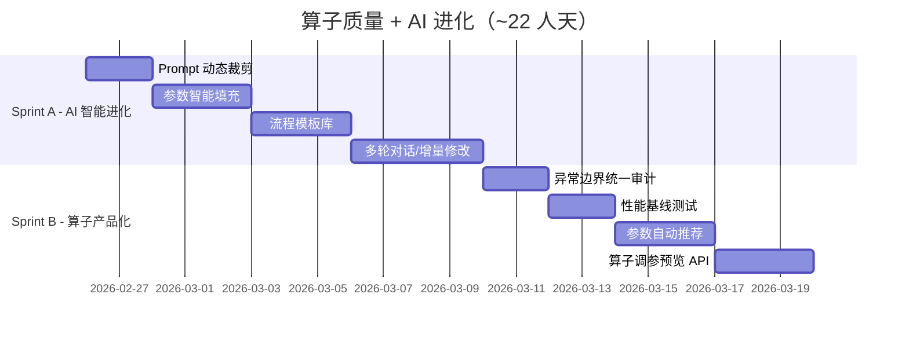

# 算子质量深化 + AI 生成进化 — TODO 规划



<!-- DOC_AUDIT_STATUS_START -->
## 文档审计状态（自动更新）
- 审计日期：2026-03-06
- 完成状态：已完成（回填）
- 任务统计：非勾选型文档，按实现与测试判定
- 判定依据：按 2026-03-06 深度审查回填：Conversational/Template/Preview/Recommender 与 Sprint7 测试均已落地。
<!-- DOC_AUDIT_STATUS_END -->


## 现状审计结果

### ✅ 已完成的基础能力（无需重复建设）

| 能力 | 实现文件 | 描述 |
|---|---|---|
| **8 维流程校验** | `AiFlowValidator.cs` (326行) | 算子类型/连线/端口类型兼容/环路/重复输入/参数/源+输出 |
| **重试 + 错误反馈** | `AiFlowGenerationService.cs` L66-180 | 校验失败自动重试，将错误信息注入下一轮 Prompt |
| **JSON 鲁棒解析** | `AiFlowGenerationService.cs` L225-272 | Markdown 代码块清洗、非纯 JSON 嵌入提取、Regex 兜底 |
| **DryRun 仿真** | `DryRunService.cs` (207行) | 沙箱执行 + 分支覆盖率统计 + 批量用例 + 覆盖率报告 |
| **拓扑自动布局** | `AutoLayoutService.cs` (100行) | Kahn 算法分层 + 坐标自动分配 |
| **Prompt 版本管理** | `PromptVersionManager.cs` (208行) | 版本创建/激活/删除 + 指标统计（成功率/Token/延迟） |
| **参数校验框架** | `OperatorBase.ValidateParameters` | abstract 强制实现，50+ 算子已有完整校验 |

### ❌ 尚未建设的进阶能力

| 能力 | 现状 | 影响 |
|---|---|---|
| **多轮对话/增量修改** | 不存在（搜索零结果） | 用户说"加一个判定"需要重新生成整个流程 |
| **Prompt 动态裁剪** | Prompt 包含全部 101 个算子目录 | Token 浪费 + 幻觉风险 ↑ |
| **参数智能填充** | AI 只填默认值 | 用户说"0.5mm 间距"无法自动转像素值 |
| **流程模板库** | 不存在 | 高频场景无法一键复用 |
| **参数自动推荐** | 不存在 | 用户需要手动调每个参数 |
| **算子调参预览 API** | 不存在 | 改参数需重跑看效果 |
| **异常边界统一审计** | 分散在各算子 | 部分算子可能遗漏空图/超大图处理 |
| **性能基线测试** | 不存在 | 无法量化算子耗时和产线节拍 |

---

## Sprint A：AI 智能进化（~12 天）

### A.1 Prompt 动态裁剪

> 当前约 101 个算子全量注入 Prompt，4000+ token。按场景裁剪可减少 60%+ 无关算子。

#### [MODIFY] [PromptBuilder.cs](file:///c:/Users/11234/Desktop/ClearVision/Acme.Product/src/Acme.Product.Infrastructure/AI/PromptBuilder.cs)

- 新增 `GetRelevantOperators(string userDescription)` 方法
- 基于关键词匹配，从用户描述中提取意图（测量/检测/通信/AI...）
- 只注入相关类别的算子到 Prompt，保留全量目录作为 fallback
- 添加 `"如果需要的算子不在列表中，仍可使用其他已注册算子"` 提示

**实现思路**：
```csharp
private List<OperatorMetadata> GetRelevantOperators(string description)
{
    var keywords = ExtractKeywords(description); // "测量宽度" → ["测量", "宽度"]
    var matched = _allMetadata
        .Where(m => m.Keywords.Any(k => keywords.Any(uk => k.Contains(uk))))
        .ToList();
    // 始终包含 ImageAcquisition + ResultOutput 等基础算子
    matched.AddRange(GetCoreOperators());
    return matched.DistinctBy(m => m.Type).ToList();
}
```

**预估**: 2 天

---

### A.2 多轮对话 / 增量修改

> 用户说"把阈值改大一点" 或 "在检测后面加一个判定" 时，在现有流程基础上增量修改。

#### [NEW] [ConversationalFlowService.cs](file:///c:/Users/11234/Desktop/ClearVision/Acme.Product/src/Acme.Product.Infrastructure/AI/ConversationalFlowService.cs)

- 维护会话上下文 `ConversationSession`：当前流程 JSON + 历史对话
- 在 System Prompt 中注入当前流程定义："以下是用户当前的工作流，请在此基础上修改"
- 支持 3 种意图自动识别：
  - `NEW` — 新建流程（无上下文时默认）
  - `MODIFY` — 修改现有流程（检测到"改/加/删/调"等动词）
  - `EXPLAIN` — 解释当前流程（检测到"为什么/解释/什么意思"）

#### [MODIFY] [AiFlowGenerationService.cs](file:///c:/Users/11234/Desktop/ClearVision/Acme.Product/src/Acme.Product.Infrastructure/AI/AiFlowGenerationService.cs)

- `BuildUserMessage` 增加 `existingFlow` 参数
- 当存在上下文时，在 Prompt 中附加当前流程的 JSON 定义

**预估**: 4 天

---

### A.3 流程模板库

> 从 PromptBuilder 的设计模式中提取为可直接使用的模板。

#### [NEW] [FlowTemplateService.cs](file:///c:/Users/11234/Desktop/ClearVision/Acme.Product/src/Acme.Product.Infrastructure/AI/FlowTemplateService.cs)

- 内置 8-10 个行业模板（传统缺陷检测、AI检测、尺寸测量、条码OCR 等）
- 每个模板包含：名称、描述、行业标签、预设算子 + 连线 + 默认参数
- 用户可从模板创建工程后自行修改参数
- 存储为 JSON 文件在 `AppData/ClearVision/templates/`

#### [NEW] [FlowTemplate.cs](file:///c:/Users/11234/Desktop/ClearVision/Acme.Product/src/Acme.Product.Core/Entities/FlowTemplate.cs)

- 模板实体：Id, Name, Description, Industry, Tags, FlowJson, CreatedAt

**预估**: 3 天

---

### A.4 参数智能填充

> 用户说"间距 0.5mm，偏差 ±0.05mm"，AI 应自动填入 `ExpectedWidth=0.5`, `Tolerance=0.05`。

#### [MODIFY] [PromptBuilder.cs](file:///c:/Users/11234/Desktop/ClearVision/Acme.Product/src/Acme.Product.Infrastructure/AI/PromptBuilder.cs)

- 在 System Prompt 中增加"参数推理指南"章节：
  - 数值提取规则：用户提到的具体数值应直接映射到对应参数
  - 单位转换提示：如果用户用 mm，算子参数是 pixel，提示需要标定数据
  - 常见默认值参考表（按行业）

#### [MODIFY] [AiFlowValidator.cs](file:///c:/Users/11234/Desktop/ClearVision/Acme.Product/src/Acme.Product.Infrastructure/AI/AiFlowValidator.cs)

- 在 `ValidateParameters` 中增加"智能默认值"逻辑：
  - 如果 AI 未填某必填参数但有默认值 → 自动填充而非报错
  - 如果数值超出 MinValue/MaxValue → 自动 Clamp 而非报错

**预估**: 3 天

---

## Sprint B：算子产品化（~10 天）

### B.1 参数自动推荐

> 基于输入图像特征自动推荐算子参数值。

#### [NEW] [ParameterRecommender.cs](file:///c:/Users/11234/Desktop/ClearVision/Acme.Product/src/Acme.Product.Infrastructure/Services/ParameterRecommender.cs)

- 接口：`Dictionary<string, object> Recommend(OperatorType type, Mat inputImage)`
- 每个算子可选实现 `IParameterRecommendable`：
  - `Thresholding` → Otsu 自动阈值
  - `Filtering/GaussianBlur` → 基于噪声估计推荐核大小
  - `BlobAnalysis` → 基于连通域统计推荐 MinArea/MaxArea
  - `SharpnessEvaluation` → 基于图像统计推荐 Threshold
- 前端调用推荐 API → 填充参数 → 用户微调

**预估**: 3 天

---

### B.2 算子调参预览 API

> 修改参数后实时预览效果，无需运行完整流程。

#### [NEW] [OperatorPreviewService.cs](file:///c:/Users/11234/Desktop/ClearVision/Acme.Product/src/Acme.Product.Infrastructure/Services/OperatorPreviewService.cs)

- 提供单算子预览执行接口：`PreviewResult Preview(OperatorType, Dictionary<string,object> params, Mat image)`
- 只执行单个算子，返回结果图 + 关键输出值
- 添加 REST API endpoint：`POST /api/operators/{type}/preview`
- 前端右侧面板实时调参预览

**预估**: 3 天

---

### B.3 异常边界统一审计

> 对所有算子的异常路径做统一审计和修复。

#### [NEW] [OperatorRobustnessTests.cs](file:///c:/Users/11234/Desktop/ClearVision/Acme.Product/tests/Acme.Product.Tests/Operators/OperatorRobustnessTests.cs)

- 统一测试框架，对每个算子执行：
  - 空图像 (`null` / `empty Mat`)
  - 1×1 图像（极小尺寸）
  - 超大图像 (10000×10000)
  - 全黑/全白图像
  - 参数全空 / 参数越界
- 期望：所有场景返回 `Failure` 而非抛异常

**预估**: 2 天

---

### B.4 性能基线测试

> 建立算子执行耗时基线，识别需要优化的瓶颈。

#### [NEW] [OperatorBenchmarkTests.cs](file:///c:/Users/11234/Desktop/ClearVision/Acme.Product/tests/Acme.Product.Tests/Performance/OperatorBenchmarkTests.cs)

- 使用标准测试图像 (1920×1080, 4096×3072) 测量每个算子的执行耗时
- 输出性能报告：算子名称、平均耗时(ms)、P95、P99
- 标记 >100ms 的算子为"需优化"
- 可集成 CI 做回归检测

**预估**: 2 天

---

## 验证计划

### 自动化测试

```bash
# Sprint A — AI 智能进化测试



<!-- DOC_AUDIT_STATUS_START -->
## 文档审计状态（自动更新）
- 审计日期：2026-03-06
- 完成状态：已完成（回填）
- 任务统计：非勾选型文档，按实现与测试判定
- 判定依据：按 2026-03-06 深度审查回填：Conversational/Template/Preview/Recommender 与 Sprint7 测试均已落地。
<!-- DOC_AUDIT_STATUS_END -->


cd c:\Users\11234\Desktop\ClearVision\Acme.Product
dotnet test tests/Acme.Product.Tests --filter "Category=Sprint7_AiEvolution" --logger "console;verbosity=detailed"

# Sprint B — 鲁棒性测试



<!-- DOC_AUDIT_STATUS_START -->
## 文档审计状态（自动更新）
- 审计日期：2026-03-06
- 完成状态：已完成（回填）
- 任务统计：非勾选型文档，按实现与测试判定
- 判定依据：按 2026-03-06 深度审查回填：Conversational/Template/Preview/Recommender 与 Sprint7 测试均已落地。
<!-- DOC_AUDIT_STATUS_END -->


dotnet test tests/Acme.Product.Tests --filter "Category=Sprint7_Robustness" --logger "console;verbosity=detailed"

# Sprint B — 性能基线



<!-- DOC_AUDIT_STATUS_START -->
## 文档审计状态（自动更新）
- 审计日期：2026-03-06
- 完成状态：已完成（回填）
- 任务统计：非勾选型文档，按实现与测试判定
- 判定依据：按 2026-03-06 深度审查回填：Conversational/Template/Preview/Recommender 与 Sprint7 测试均已落地。
<!-- DOC_AUDIT_STATUS_END -->


dotnet test tests/Acme.Product.Tests --filter "Category=Sprint7_Benchmark" --logger "console;verbosity=detailed"

# 编译



<!-- DOC_AUDIT_STATUS_START -->
## 文档审计状态（自动更新）
- 审计日期：2026-03-06
- 完成状态：已完成（回填）
- 任务统计：非勾选型文档，按实现与测试判定
- 判定依据：按 2026-03-06 深度审查回填：Conversational/Template/Preview/Recommender 与 Sprint7 测试均已落地。
<!-- DOC_AUDIT_STATUS_END -->


dotnet build --no-restore
```

### 手动验证（Sprint A）

1. **Prompt 裁剪**：输入"检测缺陷"，检查 System Prompt 中是否只包含相关算子
2. **多轮对话**：先生成一个流程，然后说"把阈值改成 100" → 验证只修改了该参数
3. **模板库**：在前端打开模板列表 → 选择"传统缺陷检测" → 验证生成完整流程
4. **参数智能填充**：输入"测量间距 0.5mm" → 验证 GapMeasurement 的 ExpectedWidth 为 0.5

---

## 开发顺序


