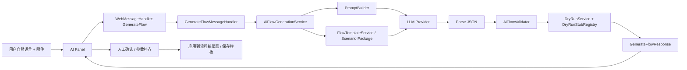

# AI 生成链路图

> 用途：回答“AI 到底负责什么，边界在哪里？”
> 核心目标：把 `Prompt / 模板 / LLM / Validator / DryRun / 人工确认 / 应用` 明确拆开。

---

## 1. AI 生成主链路

---

## 2. 每一段分别负责什么

| 环节 | 职责 | 当前证据 |
|---|---|---|
| `PromptBuilder` | 约束输出格式、Few-shot、模板优先口径 | `PromptBuilder.cs` |
| `FlowTemplateService` | 提供模板与场景化骨架，尤其是高频场景 | `FlowTemplateService.cs` |
| `LLM` | 根据提示词生成结构化流程草案 | `OpenAiConnector.cs` / `AzureOpenAiConnector.cs` / `OllamaConnector.cs` |
| `Parse JSON` | 把模型返回内容解析成内部 DTO | `AiFlowGenerationService.cs` |
| `AiFlowValidator` | 做结构/规则校验 | `AiFlowValidator.cs` |
| `DryRunService` | 用挡板做预演，提前发现可运行性问题 | `DryRunService.cs` |
| `GenerateFlowMessageHandler` | 整理结果并把推荐模板、待确认参数、缺资源带回前端 | `GenerateFlowMessageHandler.cs` |
| `人工确认` | 补真实配置、确认业务含义、决定是否采用 | 前端交互 + 人工流程 |

---

## 3. 当前最关键的边界

### 3.1 AI 能做的

- 根据自然语言生成结构化流程草案
- 推荐模板
- 标出待确认参数
- 标出缺失资源

### 3.2 AI 不能替代的

- 现场真实配置注入
- 业务验收
- 风险确认
- 最终采用决策

这也是为什么 `recommendedTemplate / pendingParameters / missingResources` 很重要，它们说明系统并没有把“AI 输出”伪装成“已经可直接上线”。

---

## 4. 为什么要模板优先，而不是全量自由生成

最核心的原因不是“模型不够聪明”，而是：

- 视觉算子空间太大
- 业务语义容易漂移
- 格式正确不等于业务正确

所以对高频场景，例如线序检测，当前更稳的做法是：

1. 先识别场景关键词
2. 先命中模板骨架
3. 再让 LLM 在这个收窄空间里补结构化结果

这也是为什么 `PromptBuilder` 和 `AiFlowGenerationService` 里都强调 `template-first`。

---

## 5. 当前链路最能打的三个亮点

1. 不是只返回一段 JSON，而是会带回模板推荐、待确认参数、缺资源。
2. 不是只做解析，而是还有 Validator 和 DryRun。
3. 不是把 AI 生成结果直接执行，而是留有人类确认口。

---

## 6. 最稳的面试回答

> 我会把 AI 生成链路拆成七步来讲：用户描述需求、PromptBuilder 组织提示词、模板服务收窄高频场景、LLM 生成结构化流程、Validator 做结构校验、DryRun 做预演、最后由人工确认是否采用。  
>  
> 这样讲的重点是，AI 在我这里不是最终裁决者，它更像一个受模板和规则约束的 copilot。系统真正稳定的关键，不是“让模型一次生成很神”，而是“让生成结果可收敛、可校验、可预演、可人工接管”。

