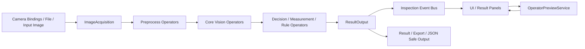

# 数据流图

> 用途：回答“数据是怎么在系统里流动的？”
> 区分点：这张图讲的是运行中的数据，不是 AI 生成 JSON 的链路。

---

## 1. 运行时数据流

---

## 2. 这条流里最重要的 5 个数据断点

### 2.1 图像源

来源可能是：

- 相机绑定
- 文件输入
- 预览输入图

关键文件：

- `ImageAcquisitionOperator.cs`
- `CameraManager.cs`
- `SettingsEndpoints.cs`

### 2.2 预处理结果

典型算子：

- `GaussianBlur`
- `Threshold`
- `Morphology`
- `CannyEdge`

这里决定的是：后续算法吃到的是不是“可用输入”。

### 2.3 核心算法结果

典型算子：

- `BlobDetection`
- `TemplateMatch`
- `DeepLearning`
- `CameraCalibration`
- `Undistort`

这里产出的通常不是最终业务结论，而是中间几何/区域/检测结果。

### 2.4 业务判断结果

典型算子：

- `DetectionSequenceJudge`
- `WidthMeasurement`
- `CircleMeasurement`
- 其他输出前的逻辑判定算子

这里才开始接近“业务语义”。

### 2.5 最终可消费输出

关键文件：

- `ResultOutputOperator.cs`
- `FlowExecutionService.cs`

这里的关键点是：

- 不把 `Mat` 这类非 JSON 安全对象直接往上抛
- 尽量把输出变成 UI 和导出都能消费的结构

---

## 3. 为什么这张图重要

很多面试会问：

- 算法结果怎么进入业务判断？
- 输出为什么不是直接从某个算子里拿一张图就结束？
- 为什么要单独有 `ResultOutput`？

最稳的回答是：

> 因为视觉算子大多输出的是中间结果，而业务系统真正需要的是可解释、可导出、可被 UI 和后续逻辑消费的结果对象，所以中间算子和最终输出层要分开。

---

## 4. 配合场景最容易讲清的例子

### 4.1 线序检测

`ImageAcquisition -> DeepLearning -> BoxFilter -> BoxNms -> DetectionSequenceJudge -> ResultOutput`

这里体现的是：

- 图像 -> 检测框 -> 去重框 -> 业务顺序判断 -> 结构化结果

### 4.2 Blob 受控演示

`ImageAcquisition -> Threshold -> Morphology -> BlobDetection -> ResultOutput`

这里体现的是：

- 图像 -> 前景分割 -> 区域提取 -> 特征筛选 -> 结果导出

---

## 5. 面试时的一句话讲法

> 我一般把数据流分成五段来讲：图像源、预处理、核心算法、中间业务判断、最终结果输出。这样可以避免把“算法中间量”和“业务可消费结果”混为一谈。

