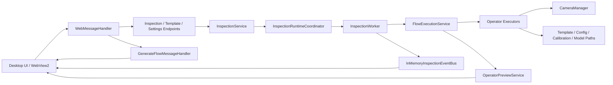

# 运行时架构图

> 用途：回答“项目运行起来之后，核心组件怎么协作？”
> 原则：只画当前仓库里能对上的主干，不画想象中的未来架构。

---

## 1. 一图看主干

---

## 2. 组件职责

| 组件 | 当前职责 | 证据文件 |
|---|---|---|
| `WebMessageHandler` | 桌面桥接层，收发前端消息，转交后端服务 | `Acme.Product/src/Acme.Product.Desktop/Handlers/WebMessageHandler.cs` |
| `InspectionRuntimeCoordinator` | 管理项目级运行状态、启动/停止、取消令牌 | `Acme.Product/src/Acme.Product.Infrastructure/Services/InspectionRuntimeCoordinator.cs` |
| `InspectionWorker` | 作为 `IHostedService` 跑检测循环，负责优雅关机与后台运行 | `Acme.Product/src/Acme.Product.Infrastructure/Services/InspectionWorker.cs` |
| `FlowExecutionService` | 执行流程、按拓扑顺序调度算子、汇总输出 | `Acme.Product/src/Acme.Product.Infrastructure/Services/FlowExecutionService.cs` |
| `OperatorPreviewService` | 单算子预览与调参 | `Acme.Product/src/Acme.Product.Infrastructure/Services/OperatorPreviewService.cs` |
| `CameraManager` | 相机枚举、绑定、打开、关闭与逻辑 ID 管理 | `Acme.Product/src/Acme.Product.Infrastructure/Cameras/CameraManager.cs` |
| `InMemoryInspectionEventBus` | 运行态事件发布与订阅 | `Acme.Product/src/Acme.Product.Infrastructure/Events/InMemoryInspectionEventBus.cs` |
| `GenerateFlowMessageHandler` | AI 生成链路的桌面桥接入口 | `Acme.Product/src/Acme.Product.Infrastructure/AI/GenerateFlowMessageHandler.cs` |

---

## 3. 为什么这个架构值得讲

### 3.1 它不是“所有东西都堆在 UI 里”

当前运行时至少已经分出：

- UI / bridge
- 项目运行状态协调
- 后台检测工作器
- 流程执行服务
- 单算子预览
- 事件总线

这说明项目已经开始从“单文件 demo”往可维护结构走。

### 3.2 它也不是“全自动黑箱”

AI 生成链路和运行时执行链路是分开的：

- 生成链路负责把需求变成结构化流程草案
- 运行时链路负责拿确定下来的流程去执行

这正好能回答面试官一个常见疑问：

> “AI 生成和真正执行是不是混成一坨了？”

当前答案是：没有完全混在一起。

---

## 4. 面试时怎么讲更稳

建议口径：

> 运行时这一块，我一般会分成三层去讲。第一层是桌面桥接层，也就是 `WebMessageHandler` 这类把前端消息接进来的入口；第二层是项目级运行状态和后台工作器，也就是 `InspectionRuntimeCoordinator + InspectionWorker`；第三层是具体流程执行和算子调度，也就是 `FlowExecutionService` 和各类 operator executors。这样讲的好处是，既能说明它已经有清晰主干，也不会把 AI 生成和运行时执行混在一起。

