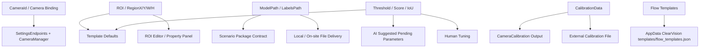

# 配置来源图

> 用途：回答“相机 ID、ROI、模型路径、阈值这些配置到底从哪来？”
> 核心：把“AI 猜出来的”和“模板默认给的”和“现场人工提供的”彻底分开。

---

## 1. 配置来源总览

---

## 2. 五类高频配置的真实来源

| 配置项 | 当前主要来源 | 不能误说成什么 | 证据 |
|---|---|---|---|
| `CameraId` | 设置页绑定 + `CameraManager` | 不能说是 AI 自动知道的 | `CameraManager.cs`、`SettingsEndpoints.cs`、`ImageAcquisitionOperator.cs` |
| `ROI / RegionX / RegionY / RegionW / RegionH` | 模板默认值 + ROI 编辑器 + 人工调整 | 不能说任何场景都能自动精确推断 | `terminal-wire-sequence.flow.template.json`、`roiEditorPanel.js` |
| `ModelPath / LabelsPath` | 场景包约束 + 本地/现场文件交付 | 不能说模型路径会被 AI 自动补成真实值 | `manifest.json`、`models/README.md`、`README.md` |
| `ScoreThreshold / IouThreshold / 业务阈值` | 模板默认值 + AI 建议 + 人工调参 | 不能说只靠 AI 自动调完 | `PromptBuilder.cs`、场景包 README、模板 JSON |
| `CalibrationData` | 标定算子输出或外部标定文件 | 不能说运行时自然存在 | `CameraCalibrationOperator.cs`、`UndistortOperator.cs` |

---

## 3. 最容易被问的四个点

### 3.1 相机 ID 从哪来

最稳的回答：

> 来自设置页的相机绑定和 `CameraManager`，不是 AI 生成流程时自己知道的。

### 3.2 ROI 从哪来

最稳的回答：

> 来自模板默认值、图上 ROI 编辑器或者人工输入，不是所有场景都适合让 AI 直接猜 ROI。

### 3.3 模型路径从哪来

最稳的回答：

> 对线序场景来说，`DeepLearning.ModelPath` 和 `DeepLearning.LabelsPath` 是明确的缺资源项，需要本地或现场交付，不是系统自动补齐的。

### 3.4 阈值从哪来

最稳的回答：

> 阈值通常有三个来源：模板默认值、AI 给出的建议范围、现场人工最终确认。真正高风险的业务阈值不能只靠模型一句话拍板。

---

## 4. 为什么这张图很重要

复盘里“AI 边界不清”的一个根因，就是把“系统生成流程”和“真实环境配置注入”混在了一起。

一旦把配置来源拆开，很多问题自然就稳了：

- 为什么 AI 不能直接替代现场工程师
- 为什么 `pendingParameters` 和 `missingResources` 很重要
- 为什么格式对不代表业务对

---

## 5. 面试里的稳定回答

> 我现在会明确把配置来源拆开讲。像相机 ID 来自绑定配置，ROI 来自模板默认值和人工编辑，模型路径和标签路径来自场景包契约与本地交付，阈值则来自模板默认、AI 建议和人工确认三部分。这样一来，AI 的责任边界就很清楚，它负责生成结构和建议，但不负责凭空知道现场真实配置。

